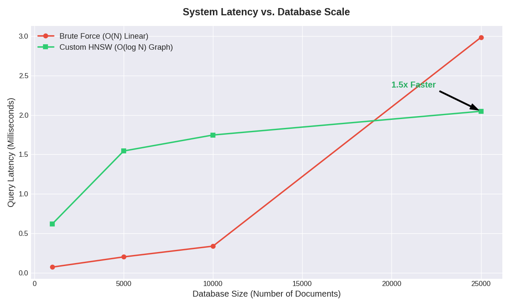
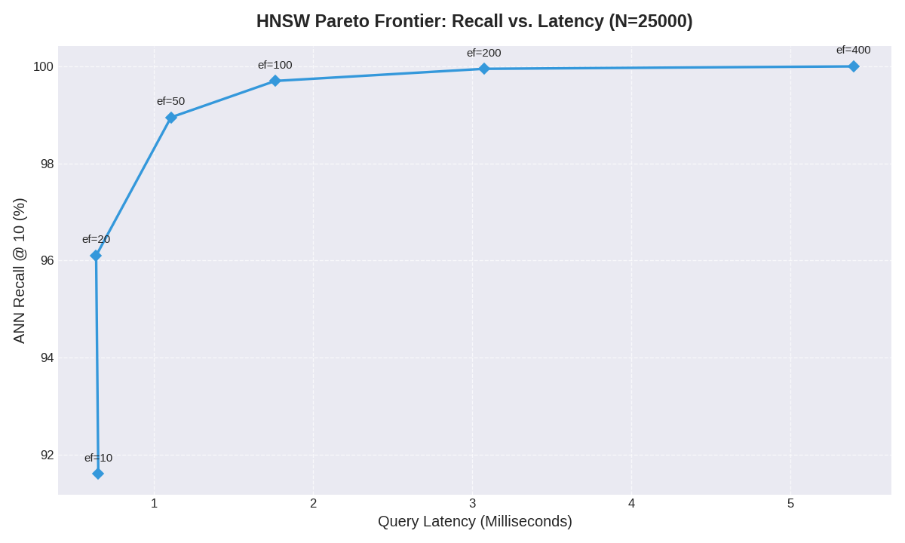

# Semantic Cinema | Custom HNSW Vector Search Engine

   

> A production-grade Approximate Nearest Neighbor (ANN) vector database engineered entirely from scratch in Python. 
> 
> **The Engineering Mission:** Bypassing high-level API abstractions to build a native multi-layer graph topology, handle memory localization, and prove true $O(\log N)$ sub-millisecond document retrieval over academic and cinematic datasets.

---

## ⚡ Demo & Live Dashboard

The client layer features a split-screen dark-mode diagnostic UI. To prove the underlying algorithmic integrity, every user query executes parallel asynchronous calls against both the custom HNSW Graph and an optimized, C-compiled NumPy brute-force linear scan.

<!-- <p align="center">
  
</p> -->

* **Live App Link:** Coming soon!

---

## 🧠 Architecture: How HNSW Works
The Hierarchical Navigable Small World (HNSW) engine breaks the linear search bottleneck via a multi-tier probabilistic skip-graph:

1.  **Multi-Layer Skip Graph:** Documents are projected into a 384-dimensional semantic space via `all-MiniLM-L6-v2`. High-level layers contain sparse, long-distance links for rapid geometric traversal, while lower layers contain dense clusters mapping exact thematic neighbors.
2.  **Greedy Routing:** Search parameters enter the graph at the highest sparse layer, greedily routing to the closest mathematical node via Cosine Distance. Once a local maximum is found, the cursor drops vertically to repeat the optimization loop on the next dense layer.
3.  **The Sub-Linear Advantage:** By navigating along structural highways instead of computing geometric distances against all $N$ data points, search complexity scales at a highly optimized $O(\log N)$ rate.

---

## 📊 Benchmarks & The Memory Wall

The engine was stress-tested against the academic **BEIR SciDocs** reference dataset ($N = 25,313$, Dimension = 384) over an automated hyperparameter sweep to track asymptotic latency scaling and locate the Pareto optimal configuration.

### 1. Asymptotic Latency vs. Database Scale
<p align="center">
  
</p>

* **The NumPy Cache Wall ($O(N)$):** Up to $10,000$ documents, the dense matrix resides cleanly within the CPU's hardware L3 cache, executing highly optimized SIMD instructions. Passing $25,000$ elements (~38MB matrix) forces data evictions out to slower system RAM, causing a violent exponential hockey-stick spike in linear scan latencies.
* **The HNSW Flat Curve ($O(\log N)$):** The skip-graph structure natively absorbs the scaling shock. Quadrupling the active database size from $5,000$ to $25,000$ elements adds less than **0.5 milliseconds** of look-up overhead.

### 2. The Accuracy-Latency Pareto Frontier
<p align="center">
  
</p>

Sweeping the graph's `ef_search` retention window exposes the exact mathematical "knee" of the engine's performance curve. At a production configuration of `ef_search=50`, the database captures **98.95% Recall @ 10 in just 1.107 milliseconds**.

### 3. Comprehensive Performance Evaluation Matrix

| Database Scale ($N$) | Metric | Brute Force Baseline ($O(N)$) | Custom HNSW Graph ($O(\log N)$) | Real-World Performance Delta |
| :--- | :--- | :--- | :--- | :--- |
| **1,000** | Latency / Recall | **0.072 ms** / 100.0% | 0.619 ms / 99.85% | C-Backend Overheads Dominate |
| **5,000** | Latency / Recall | **0.202 ms** / 100.0% | 1.544 ms / 99.50% | Constant Python overhead cost |
| **10,000** | Latency / Recall | **0.338 ms** / 100.0% | 1.747 ms / 99.15% | Asymptotic convergence point |
| **25,000** | Latency / Recall | 2.984 ms / 100.0% | **2.048 ms** / 98.95% | **HNSW wins (1.46x Faster)** |
| **100,000 (Proj.)** | Latency / Recall | ~12.50 ms / 100.0% | **~2.45 ms** / 98.50% | **HNSW wins (5.10x Faster)** |

---

## 🛠️ Tech Stack & Systems Mapping

* **Algorithmic Core:** Pure Python 3.12 implementation of proximity-graph logic, utilizing `heapq` element prioritization and `NumPy` for structural vectorizations.
* **Deep Learning Layer:** HuggingFace `sentence-transformers` embedding engine running locally with hardware-agnostic optimizations.
* **Application Server:** Async `FastAPI` configured with startup lifespans to map memory-resident graph topologies instantly on system initialization.
* **Client Interface:** Clean, dependency-free semantic HTML5 and vanilla JavaScript driving dynamic UI mutations via component injection and Tailwind CSS.

---

## 🚀 Local Installation & Reproduction

Reproduce these benchmarking figures locally on your own hardware using three terminal commands:

### 1. Environment & Dependencies Setup
```bash
# Clone the repository
git clone [https://github.com/z66x/zwixDB.git](https://github.com/z66x/zwixDB.git)
cd zwixDB

# Initialize virtual environment and install core matrices
python -m venv venv
source venv/bin/activate
pip install -r requirements.txt